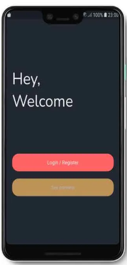

# Flutter Welcome App

A simple Flutter application displaying a welcome message, a circular progress indicator, and a login button.

## Overview

The app consists of several Flutter widgets organized in a hierarchical structure:

- MyApp: The main application widget.
- MaterialApp: Provides material design structure.
- Scaffold: Represents the basic visual structure.
- Container: Contains the main content with a background image.
- Center: Positions child widgets in the center.
- Column: Organizes children vertically.
- Text: Displays a welcome message.
- SizedBox: Adds vertical spacing.
- CircularProgressIndicator: Indicates loading state.
- ElevatedButton: Represents a login button.

## Usage

To use this app, ensure you have Flutter installed. Clone the repository and run the app using:

```bash
flutter run
```

