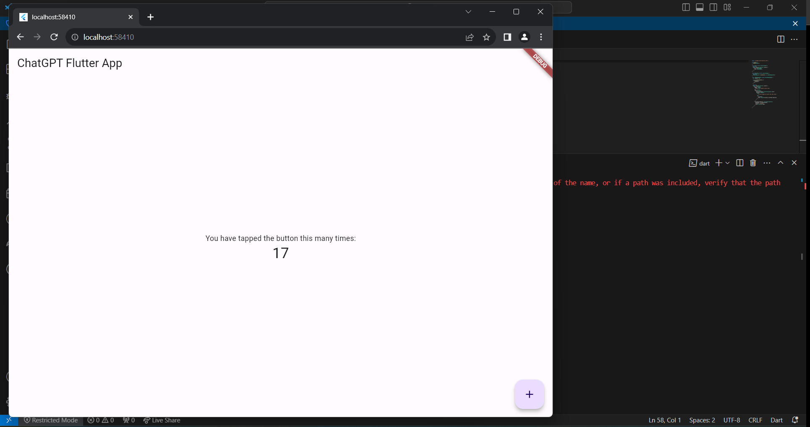

# ChatGPT Flutter App

Welcome to the ChatGPT Flutter App! This is a simple Flutter mobile app that demonstrates a basic counter functionality.

## Getting Started

### Prerequisites

Make sure you have Flutter and Dart installed on your machine. You can follow the [official Flutter installation guide](https://flutter.dev/docs/get-started/install) for more details.

### Installation

1. Clone the repository:

    ```bash
    git clone https://github.com/yourusername/chatgpt_flutter_app.git
    cd chatgpt_flutter_app
    ```

2. Run the app:

    ```bash
    flutter run
    ```

This will launch the app on your preferred emulator or connected device.

## App Overview

The ChatGPT Flutter App is a basic counter app with a floating action button that increments the counter each time it is tapped.

## Code Overview

### `lib/main.dart`

```dart
import 'package:flutter/material.dart';

void main() {
  runApp(MyApp());
}

class MyApp extends StatelessWidget {
  @override
  Widget build(BuildContext context) {
    return MaterialApp(
      home: MyHomePage(),
    );
  }
}

class MyHomePage extends StatefulWidget {
  @override
  _MyHomePageState createState() => _MyHomePageState();
}

class _MyHomePageState extends State<MyHomePage> {
  int _counter = 0;

  void _incrementCounter() {
    setState(() {
      _counter++;
    });
  }

  @override
  Widget build(BuildContext context) {
    return Scaffold(
      appBar: AppBar(
        title: Text('ChatGPT Flutter App'),
      ),
      body: Center(
        child: Column(
          mainAxisAlignment: MainAxisAlignment.center,
          children: <Widget>[
            Text(
              'You have tapped the button this many times:',
            ),
            Text(
              '$_counter',
              style: Theme.of(context).textTheme.headline4,
            ),
          ],
        ),
      ),
      floatingActionButton: FloatingActionButton(
        onPressed: _incrementCounter,
        tooltip: 'Increment',
        child: Icon(Icons.add),
      ),
    );
  }
}



